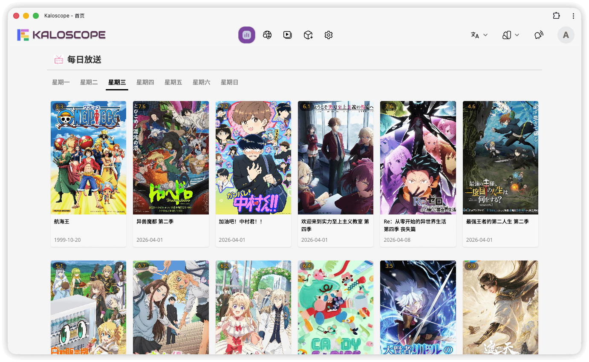
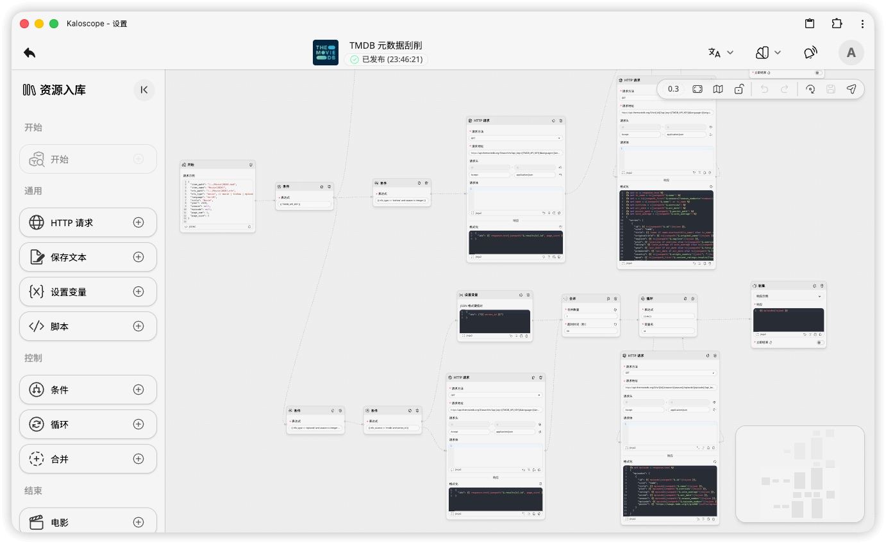
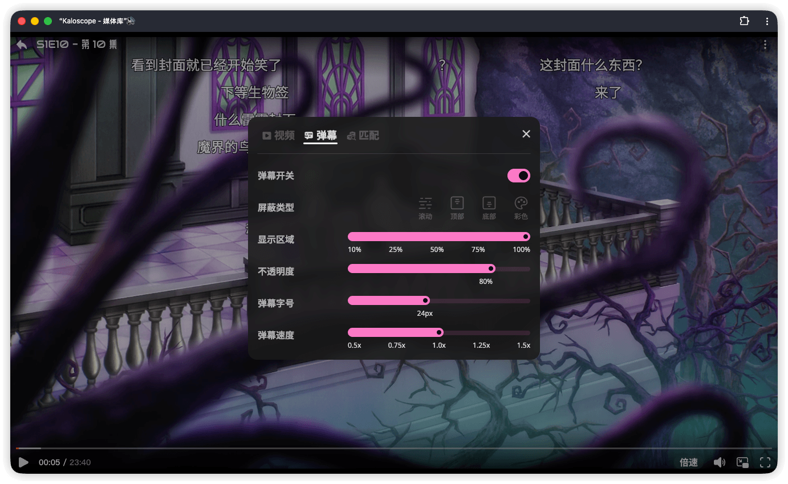

<div align="right">

📖 **English** | [简体中文](README.md)

</div>

<div align="center">


[](https://github.com/kaloscope/kaloscope/releases)
[](https://github.com/kaloscope/kaloscope/stargazers)
[](https://hub.docker.com/r/kaloscope/kaloscope)
[](https://xyflow.com/)
[](https://svelte.dev/)
[](https://sanic.dev/)
[](https://www.python.org/)
[](LICENSE)
[![Ask DeepWiki](https://img.shields.io/badge/Ask-DeepWiki-blue.svg?logo=data:image/png;base64,iVBORw0KGgoAAAANSUhEUgAAACwAAAAyCAYAAAAnWDnqAAAAAXNSR0IArs4c6QAAA05JREFUaEPtmUtyEzEQhtWTQyQLHNak2AB7ZnyXZMEjXMGeK/AIi+QuHrMnbChYY7MIh8g01fJoopFb0uhhEqqcbWTp06/uv1saEDv4O3n3dV60RfP947Mm9/SQc0ICFQgzfc4CYZoTPAswgSJCCUJUnAAoRHOAUOcATwbmVLWdGoH//PB8mnKqScAhsD0kYP3j/Yt5LPQe2KvcXmGvRHcDnpxfL2zOYJ1mFwrryWTz0advv1Ut4CJgf5uhDuDj5eUcAUoahrdY/56ebRWeraTjMt/00Sh3UDtjgHtQNHwcRGOC98BJEAEymycmYcWwOprTgcB6VZ5JK5TAJ+fXGLBm3FDAmn6oPPjR4rKCAoJCal2eAiQp2x0vxTPB3ALO2CRkwmDy5WohzBDwSEFKRwPbknEggCPB/imwrycgxX2NzoMCHhPkDwqYMr9tRcP5qNrMZHkVnOjRMWwLCcr8ohBVb1OMjxLwGCvjTikrsBOiA6fNyCrm8V1rP93iVPpwaE+gO0SsWmPiXB+jikdf6SizrT5qKasx5j8ABbHpFTx+vFXp9EnYQmLx02h1QTTrl6eDqxLnGjporxl3NL3agEvXdT0WmEost648sQOYAeJS9Q7bfUVoMGnjo4AZdUMQku50McDcMWcBPvr0SzbTAFDfvJqwLzgxwATnCgnp4wDl6Aa+Ax283gghmj+vj7feE2KBBRMW3FzOpLOADl0Isb5587h/U4gGvkt5v60Z1VLG8BhYjbzRwyQZemwAd6cCR5/XFWLYZRIMpX39AR0tjaGGiGzLVyhse5C9RKC6ai42ppWPKiBagOvaYk8lO7DajerabOZP46Lby5wKjw1HCRx7p9sVMOWGzb/vA1hwiWc6jm3MvQDTogQkiqIhJV0nBQBTU+3okKCFDy9WwferkHjtxib7t3xIUQtHxnIwtx4mpg26/HfwVNVDb4oI9RHmx5WGelRVlrtiw43zboCLaxv46AZeB3IlTkwouebTr1y2NjSpHz68WNFjHvupy3q8TFn3Hos2IAk4Ju5dCo8B3wP7VPr/FGaKiG+T+v+TQqIrOqMTL1VdWV1DdmcbO8KXBz6esmYWYKPwDL5b5FA1a0hwapHiom0r/cKaoqr+27/XcrS5UwSMbQAAAABJRU5ErkJggg==&style=flat-square)](https://deepwiki.com/kaloscope/kaloscope)
[![LINUX DO](https://img.shields.io/badge/LINUX-DO-FFB003.svg?logo=data:image/svg%2bxml;base64,DQo8c3ZnIHhtbG5zPSJodHRwOi8vd3d3LnczLm9yZy8yMDAwL3N2ZyIgd2lkdGg9IjEwMCIgaGVpZ2h0PSIxMDAiPjxwYXRoIGQ9Ik00Ni44Mi0uMDU1aDYuMjVxMjMuOTY5IDIuMDYyIDM4IDIxLjQyNmM1LjI1OCA3LjY3NiA4LjIxNSAxNi4xNTYgOC44NzUgMjUuNDV2Ni4yNXEtMi4wNjQgMjMuOTY4LTIxLjQzIDM4LTExLjUxMiA3Ljg4NS0yNS40NDUgOC44NzRoLTYuMjVxLTIzLjk3LTIuMDY0LTM4LjAwNC0yMS40M1EuOTcxIDY3LjA1Ni0uMDU0IDUzLjE4di02LjQ3M0MxLjM2MiAzMC43ODEgOC41MDMgMTguMTQ4IDIxLjM3IDguODE3IDI5LjA0NyAzLjU2MiAzNy41MjcuNjA0IDQ2LjgyMS0uMDU2IiBzdHlsZT0ic3Ryb2tlOm5vbmU7ZmlsbC1ydWxlOmV2ZW5vZGQ7ZmlsbDojZWNlY2VjO2ZpbGwtb3BhY2l0eToxIi8+PHBhdGggZD0iTTQ3LjI2NiAyLjk1N3EyMi41My0uNjUgMzcuNzc3IDE1LjczOGE0OS43IDQ5LjcgMCAwIDEgNi44NjcgMTAuMTU3cS00MS45NjQuMjIyLTgzLjkzIDAgOS43NS0xOC42MTYgMzAuMDI0LTI0LjM4N2E2MSA2MSAwIDAgMSA5LjI2Mi0xLjUwOCIgc3R5bGU9InN0cm9rZTpub25lO2ZpbGwtcnVsZTpldmVub2RkO2ZpbGw6IzE5MTkxOTtmaWxsLW9wYWNpdHk6MSIvPjxwYXRoIGQ9Ik03Ljk4IDcwLjkyNmMyNy45NzctLjAzNSA1NS45NTQgMCA4My45My4xMTNRODMuNDI2IDg3LjQ3MyA2Ni4xMyA5NC4wODZxLTE4LjgxIDYuNTQ0LTM2LjgzMi0xLjg5OC0xNC4yMDMtNy4wOS0yMS4zMTctMjEuMjYyIiBzdHlsZT0ic3Ryb2tlOm5vbmU7ZmlsbC1ydWxlOmV2ZW5vZGQ7ZmlsbDojZjlhZjAwO2ZpbGwtb3BhY2l0eToxIi8+PC9zdmc+&style=flat-square)](https://linux.do)
[](https://t.me/kaloscope_official)

[Demo](https://demo.kaloscope.org/login?username=kaloscope&password=kaloscope)
|
[Documentation](https://kaloscope.org/docs/introduction)
|
[Deployment Guide](https://kaloscope.org/docs/deployment)
|
[FAQ](https://kaloscope.org/docs/faq)
|
[Contributing](https://kaloscope.org/docs/development)
|
[Workflow Templates](https://github.com/kaloscope/workflows)
|
[Telegram Group](https://t.me/kaloscope_official)



</div>

## Overview

Kaloscope is a local media library management tool built around a visual workflow engine. Capabilities such as resource search and metadata scraping are driven by editable workflows, allowing flexible integration with any resource site or metadata source.

## Quick Start

The following example pulls and runs a standalone Kaloscope container using Docker:

```bash
docker run -d \
  --name kaloscope \
  --add-host=host.docker.internal:host-gateway \
  -e PUID=1026 \
  -e PGID=100 \
  -e UMASK=022 \
  -e TZ=Asia/Shanghai \
  -e AUTO_TLS=true \
  -e TLS_HOSTNAME=192.168.31.2 \
  -e ENABLE_ARIA2=true \
  -v /volume1/kaloscope/workspace:/workspace \
  -v /volume1/kaloscope/downloads:/downloads \
  -v /volume1/kaloscope/animes:/animes \
  -p 8000:8000 \
  -p 6888:6888 \
  -p 6888:6888/udp \
  --restart unless-stopped \
  kaloscope/kaloscope:latest
```

The parameters used above are described below.

**Environment variables (`-e`)**

| Variable       | Default | Description                                                                                                                          |
| -------------- | ------- | ------------------------------------------------------------------------------------------------------------------------------------ |
| `PUID`         | `0`     | UID used to run the process. On a NAS, set this to the owner of the media directories                                                |
| `PGID`         | `0`     | GID used to run the process. On a NAS, set this to the group that owns the media directories                                         |
| `UMASK`        | `022`   | File creation mask that controls the default permissions of new files in the container                                               |
| `TZ`           | Not set | Container timezone, such as `Asia/Shanghai` or `UTC`                                                                                 |
| `AUTO_TLS`     | `false` | Automatically issue local TLS certificates using [`mkcert`](https://github.com/FiloSottile/mkcert), useful for HTTPS access on a LAN |
| `TLS_HOSTNAME` | Not set | Hostname or IP address included in the TLS certificate; only applies when `AUTO_TLS=true`                                            |
| `ENABLE_ARIA2` | `false` | Start the built-in aria2 service in the container, useful when you do not want to deploy a separate downloader                       |

**Port mappings (`-p`)**

| Port   | Protocol | Description                                                                     |
| ------ | -------- | ------------------------------------------------------------------------------- |
| `8000` | TCP      | Kaloscope Web UI                                                                |
| `6888` | TCP/UDP  | aria2 DHT and BitTorrent listening port; only required when `ENABLE_ARIA2=true` |

**Data volumes (`-v`)**

| Container path | Required | Description                                                              |
| -------------- | -------- | ------------------------------------------------------------------------ |
| `/workspace`   | Yes      | Persistent storage that keeps application data across container restarts |

> For more configuration details, see the [`Deployment Guide`](https://kaloscope.org/docs/deployment).

## Features

|  |  |  |  |
| ------------------------------------------------------------- | ------------------------------------------------------------- | -------------------------------------------------------- | --------------------------------------------------------- |

### :wrench: Workflows

- Build workflows by dragging and connecting nodes in the visual editor
- Includes nodes for HTTP requests, Python scripts, conditional branches, loops, and more
- Import community Templates from GitHub repositories
- Use Schedules to run workflows automatically

### :mag: Search

- Workflow-driven Indexers that can integrate with any resource site
- Complete search flow with keyword search, detail previews, and authentication
- Global Search that aggregates results from multiple Indexers
- Online previews for videos, images, text, and other resource types

### :inbox_tray: Downloads

- Supports Downloaders such as [`aria2`](https://aria2.github.io/), [`qBittorrent`](https://www.qbittorrent.org/), and [`Transmission`](https://transmissionbt.com/)
- YAML-based Downloader configuration with extensible adapters
- Download Plans that automatically search and dispatch tasks using Keywords and Filters
- Manually add magnet links or torrent files

### :clapper: Media Libraries

- Supports multiple Media Library types, including Movie and TV Show
- Watches the file system in real time and automatically detects newly added media files
- Generates and parses [`NFO`](https://en.wikipedia.org/wiki/.nfo) files and synchronizes Metadata

### :arrow_forward: Playback

- Built-in video player with support for FLV, HLS, and MP4
- Server Transcode to HLS with configurable Transcode Quality and resolution limits
- Hardware Acceleration with NVENC, VAAPI, VideoToolBox, and more
- Danmaku display and a mobile-friendly styled Full Screen mode
- Playback progress tracking and Resume support

### :busts_in_silhouette: Users and Permissions

- Multi-user support with Admin and User roles
- Permissions can be assigned by Media Library and Indexer
- Per-user Preferences and custom Avatars

### :iphone: PWA Support

- Installable on desktop and mobile devices as a [`PWA`](https://web.dev/explore/progressive-web-apps)
- PWA Theme color stays synchronized with the active application Theme

## Star History

[](https://www.star-history.com/?repos=kaloscope%2Fkaloscope&type=date&legend=top-left)

## Contributors

Thank you to everyone who has contributed code, documentation, feedback, and ideas to the project.

[](https://github.com/kaloscope/kaloscope/graphs/contributors)

## Acknowledgements

- **DanDanPlay Open Platform**

  Thanks to the [`DanDanPlay Open Platform`](https://doc.dandanplay.com/open/) for providing the danmaku service API. The related proxy implementation is available in the [`kaloscope/danmaku`](https://github.com/kaloscope/danmaku) repository.

- **Third-Party Dependencies and Open Source Communities**

  This project is built on many excellent open source projects. We thank all developers and contributors for their continued work. See [`LICENSES`](LICENSES.md) for the complete list of third-party dependencies and their licenses.

## Disclaimer

- This project is intended solely for personal learning and technical exchange. Commercial use and the distribution of illegal content are prohibited
- Community or third-party workflows may contain arbitrary code or network requests; users are responsible for reviewing and verifying their security and legality
- The developers assume no joint or consequential liability for legal responsibilities, risks, or losses arising from the use of this project

## License

This project is released under the [`GPLv3`](LICENSE) open source license.
